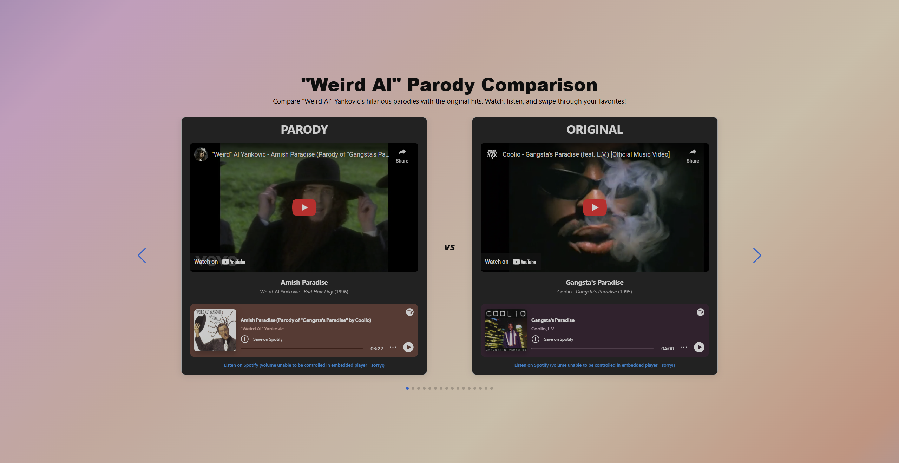

# "Weird Al" Parody Comparison

A fun web app that lets you compare "Weird Al" Yankovic’s hilarious parodies with the original hit songs they spoofed. Watch official music videos side by side, listen to Spotify snippets, and swipe through numerous classic song pairs.

---

## Screenshot & Demo

[Visit the live site](https://weird-al-parody-compare.netlify.app)

---

## Features

- Displays "Weird Al" parody vs. original song side-by-side
- Embedded **YouTube videos** for full music videos
- Embedded **Spotify player** for audio snippets
- Swipeable carousel (powered by Swiper.js) for easy browsing
- Fully responsive design for mobile and desktop
- Hosted live on Netlify

---

## Built With

- [React](https://react.dev/) + [Vite](https://vitejs.dev/)
- [Swiper.js](https://swiperjs.com/) for carousel swiping
- [Spotify Web API](https://developer.spotify.com/documentation/web-api/) (for track search)
- Netlify Functions for dynamic Spotify embed URLs

---

## Author

Ryan Smith: [smithrw1986 on GitHub](https://github.com/smithrw1986)

---

## License

This project is for educational & portfolio use only. All song content belongs to the original artists and rights holders.
